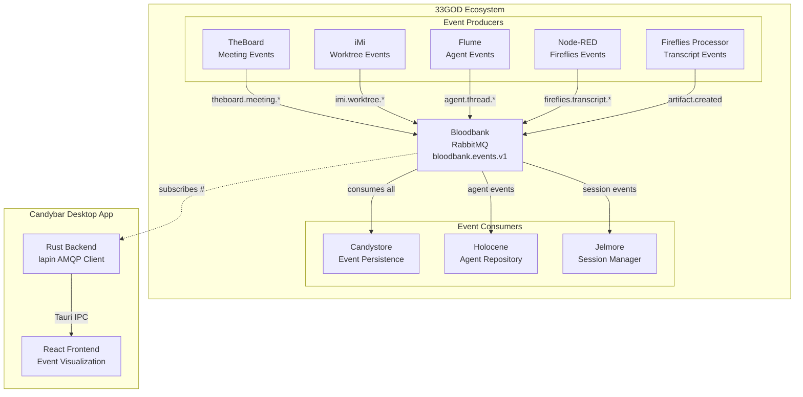

# Candybar - GOD Document

> **Guaranteed Organizational Document** - Developer-facing reference for Candybar
>
> **Last Updated**: 2026-02-02
> **Domain**: Infrastructure
> **Status**: Development

---

## Product Overview

Candybar is the real-time event observability dashboard for the 33GOD ecosystem. It provides a visual window into the Bloodbank event stream, allowing developers, DevOps engineers, and system administrators to monitor, analyze, and debug event flows across all domains.

Think of Candybar as the "control tower" for 33GOD's event-driven architecture - a desktop application that connects directly to RabbitMQ and displays live events as they flow through the system, with domain-based visualization, filtering, and detailed payload inspection.

**Key Capabilities:**
- Real-time event stream consumption from Bloodbank (RabbitMQ)
- Domain-based event visualization (Cloud View, List View, Flow View)
- Advanced event filtering by domain, type, source, session, time range, and errors
- Event payload inspection with collapsible JSON tree viewer
- Live statistics dashboard (total events, events/min, error rate, active domains)
- Cross-platform desktop application (Windows, macOS, Linux)
- Export events to JSON or CSV format

---

## Architecture Position



**Role in Pipeline**: Candybar is a **read-only observer** that subscribes to all Bloodbank events (routing key `#`) for visualization and debugging purposes. It does not emit events or participate in event processing - it exists purely to provide visibility into the event stream.

---

## Event Contracts

### Bloodbank Events Emitted

| Event Name | Routing Key | Payload Schema | Trigger Condition |
|------------|-------------|----------------|-------------------|
| _(None)_ | - | - | Candybar is read-only and does not emit events |

> **Note**: Candybar intentionally does not emit events to Bloodbank. It is a passive observer designed to provide visibility without adding noise to the event stream.

### Bloodbank Events Consumed

| Event Pattern | Routing Key | Handler | Purpose |
|---------------|-------------|---------|---------|
| All Events | `#` (wildcard) | `consume_events()` | Visualize entire event stream |
| Agent Events | `agent.thread.*` | Displayed in Agent domain bubble | Monitor agent activity |
| Fireflies Events | `fireflies.transcript.*` | Displayed in Fireflies domain bubble | Track transcript processing |
| GitHub Events | `github.pr.*` | Displayed in GitHub domain bubble | Monitor PR activity |
| LLM Events | `llm.*` | Displayed in LLM domain bubble | Track LLM interactions |
| TheBoard Events | `theboard.meeting.*` | Displayed in TheBoard domain bubble | Monitor brainstorming sessions |
| Workflow Events | `workflow.step.*` | Displayed in Workflow domain bubble | Track n8n workflows |
| Artifact Events | `artifact.file.*` | Displayed in Artifact domain bubble | Monitor file operations |

---

## Non-Event Interfaces

### CLI Interface

Candybar now provides a lightweight terminal stream helper for quick observability checks without launching the desktop UI.

| Command | Description |
|---------|-------------|
| `bun run stream` | Subscribes to `bloodbank.events.v1` with routing key `#` and prints live events |
| `bun run stream -- "webhook.plane.#"` | Subscribe to a specific routing key pattern |

**Environment variables supported by stream helper:**
- `RABBIT_URL` (preferred)
- `EXCHANGE_NAME` (defaults to `bloodbank.events.v1`)
- `DEFAULT_USERNAME` / `DEFAULT_PASSWORD` or `RABBIT_USER` / `RABBIT_PASS`
- `RABBIT_HOST` / `RABBIT_PORT`

### Web UI Interface

**URL**: `http://localhost:1420` (development mode via Vite)

**Features:**

| Feature | Location | Description |
|---------|----------|-------------|
| Connection Toggle | Header | Connect/disconnect from RabbitMQ |
| View Mode Selector | Header | Switch between List, Cloud, and Flow views |
| Statistics Cards | Main Content | Total events, events/min, error rate, domains |
| Event Filters | Collapsible Panel | Domain, type, source, time range, session, errors |
| Event Stream | List View | Scrollable list of recent events (50 displayed) |
| Event Details | Side Panel | Full event payload inspection |
| Event Cloud | Cloud View | Domain-based bubble visualization |
| Event Flow | Flow View | Source -> Event -> Target flow diagram |
| Theme Toggle | Header | Light/dark mode |
| Export | Header | Export filtered events to JSON |

### Tauri Commands (Internal IPC)

These commands are invoked by the React frontend to control the Rust backend:

| Command | Signature | Purpose |
|---------|-----------|---------|
| `rabbitmq_connect` | `(config: RabbitConfig) -> Result<(), String>` | Establish RabbitMQ connection |
| `rabbitmq_disconnect` | `() -> Result<(), String>` | Close RabbitMQ connection |
| `rabbitmq_default_config` | `() -> RabbitConfig` | Get default connection settings |

### Tauri Events (Backend to Frontend)

| Event | Payload | Purpose |
|-------|---------|---------|
| `bloodbank:event` | `BloodbankEvent` | Incoming Bloodbank event |
| `rabbitmq:connected` | `RabbitMQConfig` | Connection established |
| `rabbitmq:disconnected` | `()` | Connection closed |

---

## Technical Deep-Dive

### Technology Stack

- **Language (Backend)**: Rust 2021 Edition (v1.70+)
- **Language (Frontend)**: TypeScript 5.9
- **Framework (Desktop)**: Tauri 2.9 (cross-platform desktop)
- **Framework (UI)**: React 19.1, Vite 6.3
- **UI Components**: shadcn/ui (Radix primitives), Framer Motion, Recharts
- **Styling**: Tailwind CSS 4.1
- **RabbitMQ Client**: lapin 2.3 (Rust AMQP)
- **Async Runtime**: Tokio 1.x
- **Package Manager**: Bun

### Architecture Pattern

Candybar follows a **Hybrid Architecture** combining:

1. **Event-Driven Backend (Rust)**
   - Async RabbitMQ consumer using lapin
   - Tokio runtime for non-blocking I/O
   - State management via `Arc<Mutex<RabbitState>>`
   - Events emitted to frontend via Tauri IPC

2. **Component-Based Frontend (React)**
   - Unidirectional data flow with hooks
   - Custom `useRabbitMQ` hook for state management
   - Event batching (100ms window) for performance
   - Memoized filtering with `useEventFiltering`

### Key Implementation Details

#### RabbitMQ Connection Flow

```
1. User clicks "Connect" button
2. Frontend invokes `rabbitmq_connect` Tauri command
3. Rust backend creates AMQP connection (lapin)
4. Declares topic exchange: bloodbank.events.v1
5. Creates exclusive queue: candybar.{uuid}
6. Binds queue with routing key "#" (all events)
7. Spawns consumer task (Tokio)
8. Emits `rabbitmq:connected` event
```

#### Event Processing Pipeline

```
RabbitMQ Delivery (bytes)
    |
    v
UTF-8 String Parsing
    |
    v
JSON Deserialization (serde_json)
    |
    v
BloodbankEvent Struct
    |
    v
Tauri Event Emission (bloodbank:event)
    |
    v
React Listener (event batching, 100ms window)
    |
    v
State Update (prepend to events array)
    |
    v
UI Re-render (filtered view)
```

#### Event Buffer Strategy

- **Maximum Events**: 500 (configurable via `useRabbitMQ(maxEvents)`)
- **Strategy**: FIFO (oldest events evicted when buffer full)
- **Implementation**: `[newEvent, ...prev].slice(0, maxEvents)`
- **Display Limit**: 50 events shown in list view
- **Batching**: Events accumulated for 100ms before state update

### Data Models

#### Rust Types (`src-tauri/src/rabbitmq.rs`)

```rust
pub struct BloodbankEvent {
    pub event_id: String,
    pub event_type: String,      // e.g., "fireflies.transcript.ready"
    pub timestamp: String,       // ISO 8601
    pub source: EventSource,
    pub correlation_ids: Vec<String>,
    pub agent_context: Option<AgentContext>,
    pub payload: serde_json::Value,
}

pub struct EventSource {
    pub host: String,
    pub app: String,
    pub source_type: String,     // "webhook" | "api" | "internal" | "agent"
}

pub struct AgentContext {
    pub agent_name: Option<String>,
    pub session_id: Option<String>,
    pub project: Option<String>,
}

pub struct RabbitConfig {
    pub host: String,            // default: "localhost"
    pub port: u16,               // default: 5672
    pub username: String,        // default: from env or "guest"
    pub password: String,        // default: from env or "guest"
    pub exchange: String,        // default: "bloodbank.events.v1"
    pub routing_keys: Vec<String>, // default: ["#"]
}
```

#### TypeScript Types (`src/types/bloodbank.ts`)

```typescript
interface BloodbankEvent<T = unknown> {
  event_id: string;
  event_type: string;
  timestamp: string;
  source: EventSource;
  correlation_ids: string[];
  agent_context?: AgentContext;
  payload: T;
}

const BLOODBANK_DOMAINS = {
  agent: { label: 'Agent', color: '#3B82F6' },
  artifact: { label: 'Artifact', color: '#10B981' },
  fireflies: { label: 'Fireflies', color: '#F59E0B' },
  github: { label: 'GitHub', color: '#6366F1' },
  llm: { label: 'LLM', color: '#8B5CF6' },
  theboard: { label: 'TheBoard', color: '#EC4899' },
  workflow: { label: 'Workflow', color: '#14B8A6' },
};
```

### Configuration

#### Default RabbitMQ Configuration

| Setting | Default Value | Environment Variable |
|---------|---------------|---------------------|
| Host | `localhost` | - |
| Port | `5672` | - |
| Username | `guest` | `DEFAULT_USERNAME` |
| Password | `guest` | `DEFAULT_PASSWORD` |
| Exchange | `bloodbank.events.v1` | - |
| Routing Keys | `["#"]` | - |

#### Tauri Configuration (`src-tauri/tauri.conf.json`)

```json
{
  "productName": "candybar",
  "identifier": "com.candybar.dev",
  "version": "0.1.0",
  "bundle": {
    "category": "DeveloperTool",
    "targets": "all"
  },
  "build": {
    "beforeDevCommand": "bun run vite:dev",
    "devUrl": "http://localhost:1420",
    "frontendDist": "../dist"
  }
}
```

---

## Development

### Prerequisites

- **Node.js** 18+ and **Bun** (package manager)
- **Rust** 1.70+ with Cargo
- **Tauri CLI** (`bun add -g @tauri-apps/cli`)
- **RabbitMQ** running locally (or remote access)

### Setup

```bash
# Navigate to candybar directory
cd /home/delorenj/code/33GOD/candybar

# Install Node.js dependencies
bun install

# Install Rust dependencies (automatic via Cargo)
cd src-tauri && cargo fetch && cd ..
```

### Running Locally

```bash
# Start development mode (Vite + Tauri)
bun run dev

# Alternative: Run Vite only (no Tauri)
bun run vite:dev

# Terminal live stream helper (no GUI)
bun run stream
# or scoped pattern:
bun run stream -- "webhook.plane.#"

# Build production binary
bun run tauri build
```

### Testing

```bash
# Run ESLint
bun run lint

# Run Clippy (Rust linter)
bun run clippy

# No automated tests yet (planned)
```

### Project Structure

```
candybar/
├── src/                      # React frontend
│   ├── components/           # UI components
│   │   ├── EventCloud.tsx    # Domain bubble visualization
│   │   ├── EventFilters.tsx  # Filter panel
│   │   ├── EventFlowDiagram.tsx  # Flow view
│   │   ├── EventGraph.tsx    # Sub-event exploration
│   │   ├── JsonViewer.tsx    # Collapsible JSON tree
│   │   ├── ModeToggle.tsx    # Theme toggle
│   │   ├── ThemeProvider.tsx # Dark/light mode
│   │   ├── magicui/          # Animation components
│   │   └── ui/               # shadcn/ui primitives
│   ├── hooks/
│   │   ├── useRabbitMQ.ts    # RabbitMQ state management
│   │   └── useEventFiltering.ts  # Filter logic
│   ├── pages/
│   │   └── Home.tsx          # Main dashboard
│   ├── types/
│   │   └── bloodbank.ts      # Type definitions
│   ├── lib/
│   │   └── utils.ts          # Utility functions
│   ├── App.tsx               # Root component
│   └── main.tsx              # Entry point
├── src-tauri/                # Rust backend
│   ├── src/
│   │   ├── main.rs           # Tauri app initialization
│   │   └── rabbitmq.rs       # RabbitMQ connection manager
│   ├── Cargo.toml            # Rust dependencies
│   └── tauri.conf.json       # Tauri configuration
├── docs/                     # Documentation
│   ├── architecture-candybar-2026-01-12.md
│   ├── USER_GUIDE.md
│   └── QUICK_START.md
└── package.json              # Node.js dependencies
```

---

## Deployment

### Desktop Binary Build

```bash
# Build for current platform
bun run tauri build

# Output locations:
# - Windows: src-tauri/target/release/bundle/msi/*.msi
# - macOS: src-tauri/target/release/bundle/dmg/*.dmg
# - Linux: src-tauri/target/release/bundle/appimage/*.AppImage
```

### CI/CD (GitHub Actions)

Two workflows in `.github/workflows/`:

1. **eslint_clippy.yml**: Runs ESLint and Clippy on push/PR
2. **build.yml**: Builds desktop binaries for all platforms

### Distribution

Candybar is a **standalone desktop application** - no server deployment required. Users download and run the binary locally.

**Requirements for Users:**
- Access to RabbitMQ broker (Bloodbank)
- Network connectivity to `localhost:5672` (default) or configured host

---

## Registry Integration

Candybar reads from and is referenced in the services registry at `/home/delorenj/code/33GOD/services/registry.yaml`:

**Exchange Configuration Used:**
```yaml
exchange:
  name: "bloodbank.events.v1"
  type: "topic"
  durable: true
```

**Service Topology Reference:**
Candybar displays all services defined in the registry, organized by topology layer:
- Layer 0: Infrastructure (event-store-manager)
- Layer 1: Event producers (theboard-producer)
- Layer 2: External sources (fireflies, github)
- Layer 3: Collectors (llm-collector, agent-thread-collector)
- Layer 4: Processors (fireflies-transcript-processor)
- Layer 5: Orchestrators (theboard-meeting-trigger)
- Layer 6: Notifiers (fireflies-transcript-notifier, theboard-sync)
- Layer 7: Error handlers (artifact-processor)

---

## UI Features Reference

### View Modes

| Mode | Description | Use Case |
|------|-------------|----------|
| **List View** | Scrollable event stream with details panel | Debugging specific events |
| **Cloud View** | Domain-based bubble visualization | System overview, activity patterns |
| **Flow View** | Source -> Event -> Target diagram | Understanding event routing |

### Event Filtering

| Filter | Options | Behavior |
|--------|---------|----------|
| Domain | all, agent, artifact, fireflies, github, llm, theboard, workflow | Filter by event domain |
| Event Type | Domain-specific event types | Filter by specific routing key |
| Source App | Dynamic (from events) | Filter by source application |
| Time Range | all, 5min, 15min, 1hr, 6hr, 24hr | Filter by recency |
| Session ID | Dynamic (from events) | Filter by agent session |
| Errors Only | Toggle | Show only error/failed events |
| Search Text | Free text | Search in event type and payload |

### Statistics Dashboard

| Metric | Calculation | Update Frequency |
|--------|-------------|------------------|
| Total Events | `events.length` | On each event |
| Events/Min | Events in last 60 seconds | On each event |
| Error Rate | `(error events / total) * 100%` | On each event |
| Unique Domains | Distinct domains in buffer | On each event |

---

## Performance Characteristics

| Metric | Value | Notes |
|--------|-------|-------|
| Event Buffer Size | 500 events | Configurable |
| Event Batching Window | 100ms | Reduces re-renders |
| Display Limit | 50 events | List view pagination |
| Memory Footprint | ~5-10 MB | With 500 events buffered |
| Event Processing Latency | ~10-15ms | From receipt to UI display |
| Binary Size | ~3 MB | Tauri advantage |

---

## Future Enhancements

**Planned (v0.2-0.3):**
- Automatic reconnection with exponential backoff
- Virtual scrolling for large event lists
- Event persistence to IndexedDB
- OS credential manager integration
- Unit and integration tests

**Planned (v0.4+):**
- Timeline view visualization
- Correlation graph (linked events)
- Desktop notifications for alerts
- Multi-connection support
- Plugin system

---

## References

- **Domain Doc**: `docs/domains/infrastructure/GOD.md`
- **System Doc**: `docs/GOD.md`
- **Source**: `/home/delorenj/code/33GOD/candybar/`
- **Architecture Doc**: `/home/delorenj/code/33GOD/candybar/docs/architecture-candybar-2026-01-12.md`
- **Services Registry**: `/home/delorenj/code/33GOD/services/registry.yaml`
- **Tauri Docs**: https://tauri.app/
- **lapin Docs**: https://docs.rs/lapin/
