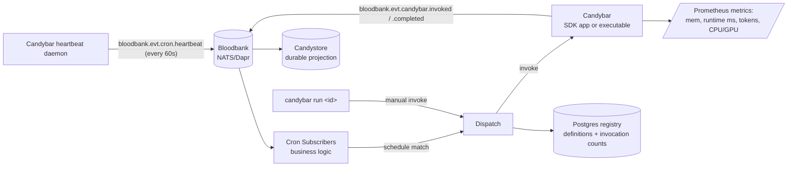
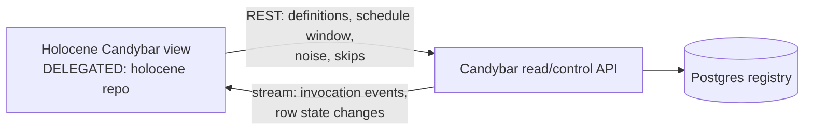

# Architecture diagrams

## Heartbeat and dispatch

```mermaid
flowchart LR
    HB[Candybar heartbeat daemon] -->|"bloodbank.evt.cron.heartbeat (every 60s)"| BB[(Bloodbank<br/>NATS/Dapr)]
    BB --> SUB[Cron Subscribers<br/>business logic]
    SUB -->|schedule match| DISP[Dispatch]
    DISP -->|invoke| CB[Candybar<br/>SDK app or executable]
    CB -->|"bloodbank.evt.candybar.invoked / .completed"| BB
    CB --> MET[/Prometheus metrics:<br/>mem, runtime ms, tokens, CPU/GPU/]
    BB --> CS[(Candystore<br/>durable projection)]
    DISP --> REG[(Postgres registry<br/>definitions + invocation counts)]
    CLI[candybar run &lt;id&gt;] -->|manual invoke| DISP
```

## Read side (delegated view contract)

```mermaid
flowchart LR
    HOL[Holocene Candybar view<br/>DELEGATED: holocene repo] -->|REST: definitions, schedule window,<br/>noise, skips| API[Candybar read/control API]
    API --> REG[(Postgres registry)]
    API -->|stream: invocation events,<br/>row state changes| HOL
```
